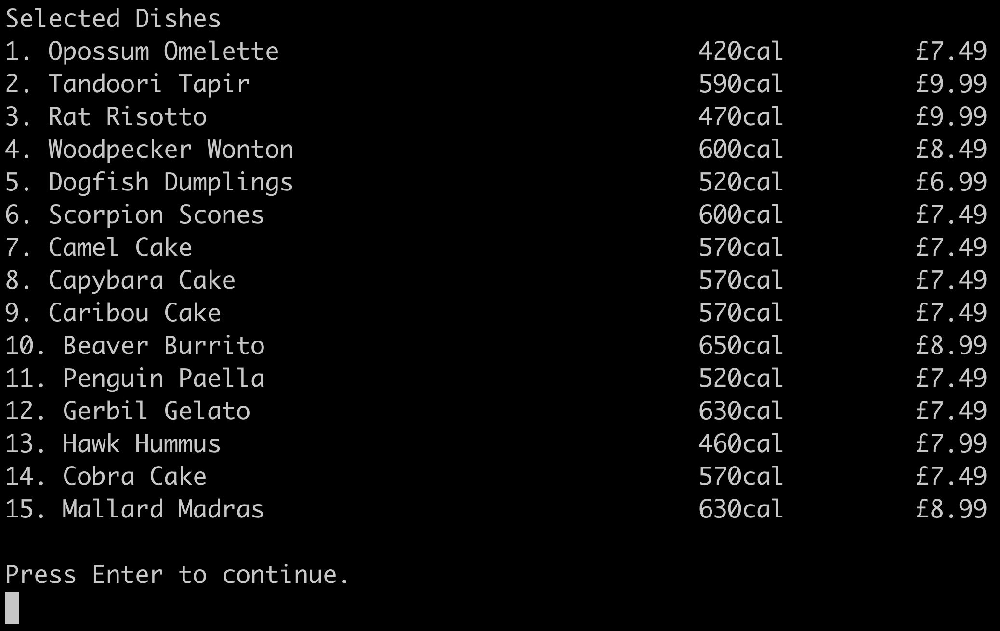
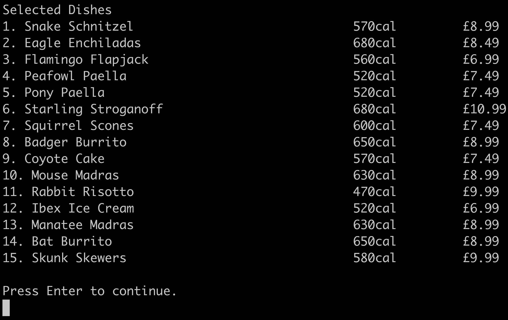
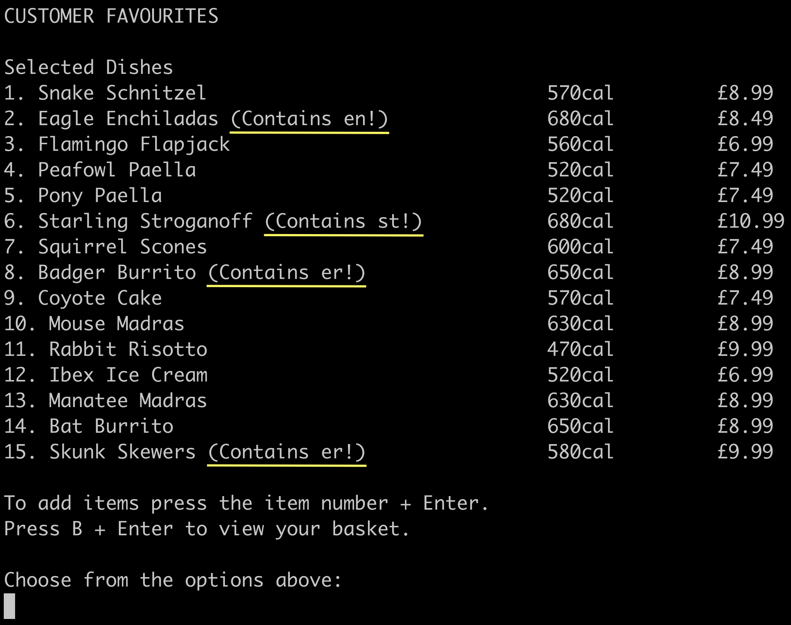
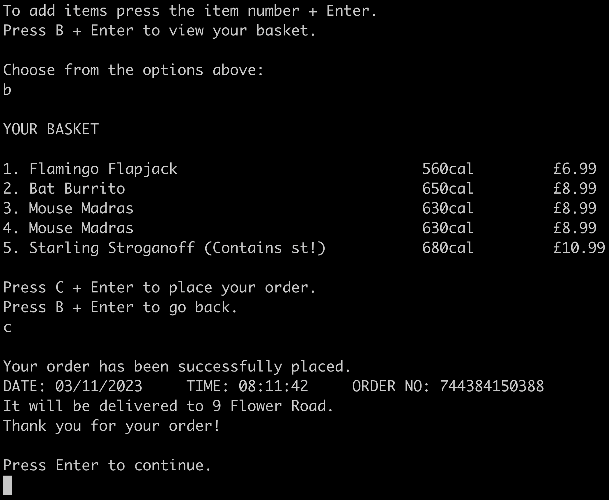
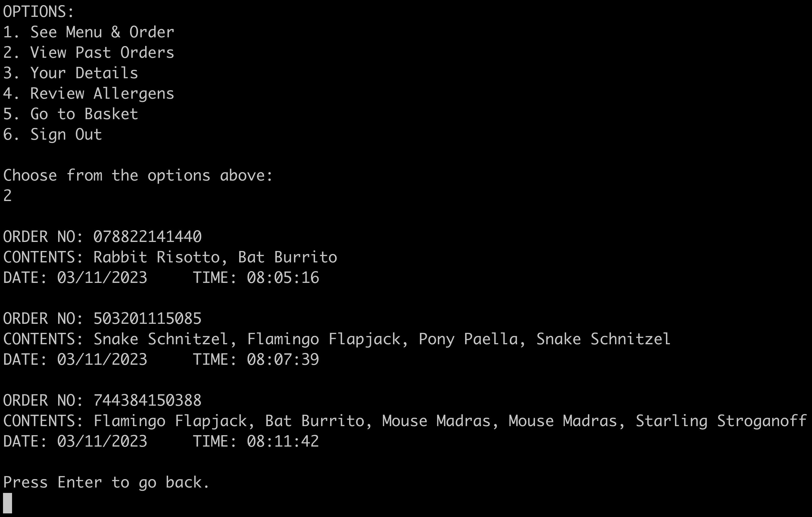
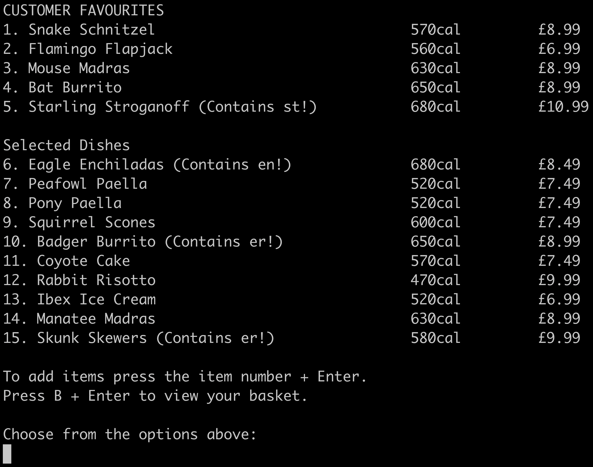

# Takeaway Orderer Project

## Introduction
This is a project that I really went nuts on and did so many things with. It was at the end of week 4 of the Makers Academy bootcamp. The project has many features and parts to it. See Part 1 in [recipe.md](https://github.com/shakey0/TakeawayProject/blob/main/recipe.md#1-describe-the-problem) for the initial requirements of which I went far beyond. Part 2 in [recipe.md](https://github.com/shakey0/TakeawayProject/blob/main/recipe.md#2-design-the-class-system) shows my planning of the class system.

## Features

Upon running the app, 50 animals are chosen from the animal list in [list_of_animals.py](list_of_animals.py) . This list of animals along with the [menu.csv](menu.csv) are then parsed to the TakeawayOrderer class upon initialisation (see [takeaway_orderer.py](https://github.com/shakey0/TakeawayProject/blob/main/lib/takeaway_orderer.py#L12)). During the init process for this class, 15 of these animals are then taken and matched with dishes from [menu.csv](menu.csv) according to their first 2 letters or first letter.
- This ensures that each time the app is run, a new amusing set of animals are matched with dish names.
- This menu is now used until the running of the app is terminated.
- (If you want a quick rundown of what the code in [takeaway_orderer.py](https://github.com/shakey0/TakeawayProject/blob/main/lib/takeaway_orderer.py#L16) is doing, copy and paste it into ChatGPT.)
- Below are 2 examples of different randomly generated menus.

<p align="center">
    
    &nbsp;&nbsp;&nbsp;&nbsp;
    
</p>

Next, the user enters their details, essentially creating some kind of account.
- name, address, **allergens**, phone number
- The **allergens** here are something I spent a lot of time on.
    - An allergen in this app is any 2 letters of the alphabet together (ox, er, pl, oa, ii) - the customer chooses this.
    - Customers can choose from 0 to as many allergens as they like.
    - The allergens are stored in a list in the instance of the Customer class.
    - Each time the menu is printed, any dishes containing the 2 consecutive letters of the allergen will have a warning message next to it.
    - (If you want to see the code for this, look at the 'add_allergens_to_food_titles' method in [takeaway_orderer.py](https://github.com/shakey0/TakeawayProject/blob/main/lib/takeaway_orderer.py#L94) .)
    - Below is an example of how the allergen warning messages are added.

<p align="center">
    
</p>

Once the user has entered their details, the main menu will be shown. This menu has 6 options:
1. **See Menu & Order** (Upon pressing '1' + 'Enter' the menu with any allergens is displayed. The user can then add dishes to their basket from here. <em>To go back to the main menu from here press 'Q' + 'Enter'.</em>)
2. **View Past Orders** (Upon pressing '2' + 'Enter' the user's pasts orders are shown.)
3. **Your Details** (Upon pressing '3' + 'Enter' the user's details are shown. The user can then amend any of their details.)
4. **Review Allergens** (Upon pressing '4' + 'Enter' the user's allergens are shown. The user can then remove or add allergens. Next time the menu is shown, these changes are reflected.)
5. **Go to Basket** (Upon pressing '5' + 'Enter' the user can see their basket. If it's got any items in it, they can choose to place their order by pressing 'C' + 'Enter'.)
6. **Sign Out** (Upon pressing '6' + 'Enter' the app will terminate.)

Below is an example of when a customer places an order and the message they get confirming their order.

<p align="center">
    
</p>

Below is an example of option 2 'View Past Orders'. You can see the **datetime module** being used here when a user places an order. A **unique random order number** is generated too.

<p align="center">
    
</p>

One more thing I've included in this app is **Customer Favourites**.
- The app keeps track of how many times each item is ordered and it uses this to add them to the top 5 dishes.
- (If you want to see the code for this, look at the 'get_most_popular_dishes' method in [menu.py](https://github.com/shakey0/TakeawayProject/blob/main/lib/menu.py#L15) .)
- Below is an example of this. (You can see that these dishes are in the previous example too.)

<p align="center">
    
</p>

## Testing

This is a test-driven project. I have used Mocks to test the classes individually.

## Installation & Setup

Run the following command to clone the repo:
```bash
git clone https://github.com/shakey0/TakeawayProject
cd TakeawayProject
```

Create your virtual environment:
```bash
pipenv install
```

Run the tests:
```bash
pytest
```

Start the app:
```bash
python app.py
```